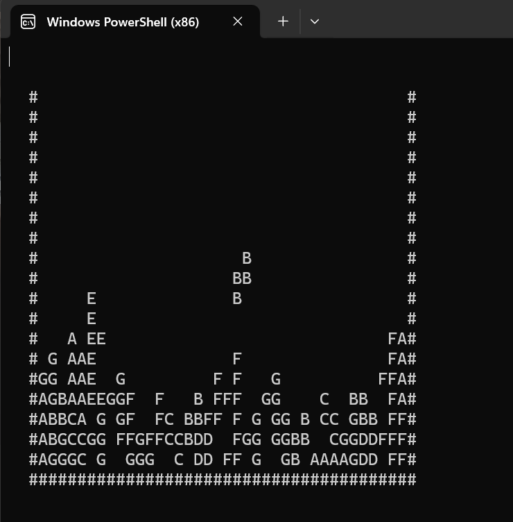

# Command-Line-Tetris
Classic Tetris game implemented in C++, bringing the iconic block-stacking challenge to the command line for a retro gaming experience.

# Tetris in C++



Welcome to Tetris in C++, a classic implementation of the legendary block-stacking game brought to the command line. This project offers a nostalgic gaming experience with a familiar interface.

## Gameplay

- **Controls:**
  - Left Arrow or A: Move block left
  - Right Arrow or D: Move block right
  - Down Arrow or S: Accelerate block descent
  - Z: Rotate block
  - ctrl + C: Quit the game

- **Objective:**
  - Clear lines by filling them with blocks to earn points.
  - The game ends when the blocks reach the top.

## Screenshots and Videos


Watch the Tetris gameplay in action: [Tetris Gameplay Video](video_tetris.mkv)

- C++ compiler (e.g., g++)
- Terminal or command prompt

### Build and Run

1. Clone the repository:
   ```bash
   git clone https://github.com/sikakoluchaitanya/Command-Line-Tetris.git

2. run the file Tetris.cpp
   ```
   g++ Tetris.cpp -o output.exe -lstdc++ -std=c++11
   .\output.exe
   ```
   // the above lines are for windows

by Chaitanya sikakolu

